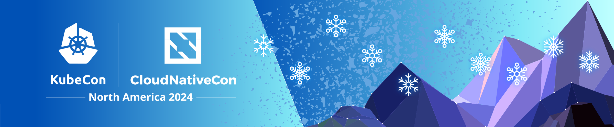

Helm is going to be at KubeCon / CloudNativeCon North America in Salt Lake City. There will be something happening each day of the main conference, including:<!-- truncate -->

* Wednesday: 
  * At a booth in the project pavilion from 3:15pm - 8pm.
  * At 7pm MST we are planning to cut a release, live.
* Thursday: 
  * At a project pavilion booth from 1:45pm - 5pm.
  * Session: [Contribfest: Helm 4: The Next Generation of the Kubernetes Package Manager](https://kccncna2024.sched.com/event/1howt)
  * Session: [The Path to Helm 4](https://kccncna2024.sched.com/event/1hoxU)
* Friday:
  * 12:30pm - 2:30pm at the project pavilion

If you want to talk with a maintainer to learn about Helm or just give feedback, the project pavilion is the perfect place to do that. If you want to learn about Helm v4 the session "The Path to Helm 4" is going to give you an overview. If you want to make your first contributions to Helm, the Contribfest session is a place to get started.

If you're going to be in Salt Lake City, we hope to see you there.