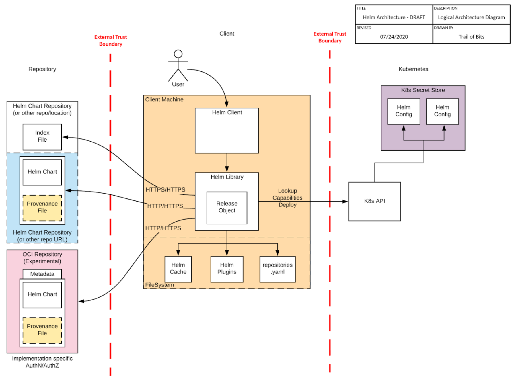

Helm has now completed a second security audit, funded by the [CNCF](https://cncf.io). The [first audit](https://helm.sh/blog/2019-11-04-helm-security-audit-results/) focused on the source code for the Helm client along with the process Helm uses to handle security. The second audit, performed by [Trail of Bits](https://www.trailofbits.com/), looked at the source code for the Helm client along with a threat model for the use of Helm.<!--more-->

The following diagram is from the [threat model](https://github.com/helm/community/blob/main/security-audit/Helm%20Threat%20Model%202020.pdf) and looks at the connections Helm makes along with how it stores files on the local filesystem.

As a result of the audit, the Helm security team worked on [a release](https://github.com/helm/helm/releases/tag/v3.3.2).

We want to thank the CNCF for providing these security assessments. They provide an expert and outside look at projects, like Helm, so that we can have more security cloud native tooling. We also want to thank Trail of Bits for the assessment. It was a pleasure working with them.

You can get the full reports for the [threat model](https://github.com/helm/community/blob/main/security-audit/Helm%20Threat%20Model%202020.pdf) and [security assessment](https://github.com/helm/community/blob/main/security-audit/Helm%20Final%20Report%202020.pdf) in the [Helm community repository](https://github.com/helm/community/tree/main/security-audit).
